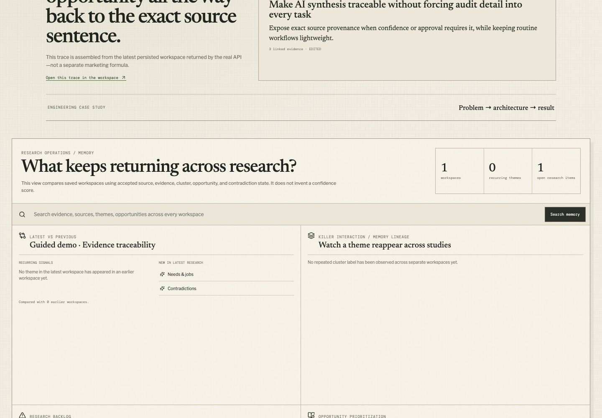
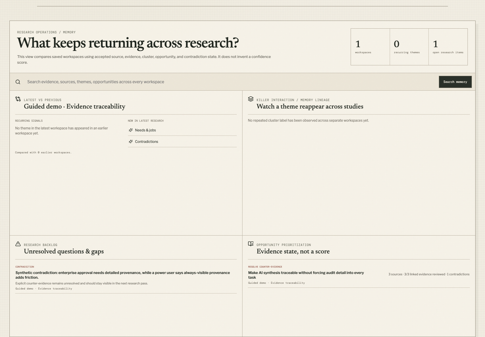
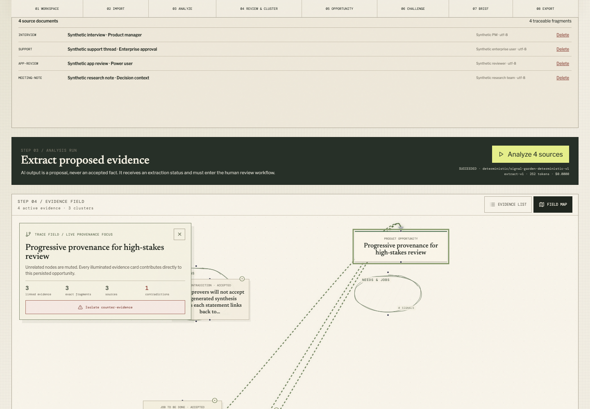
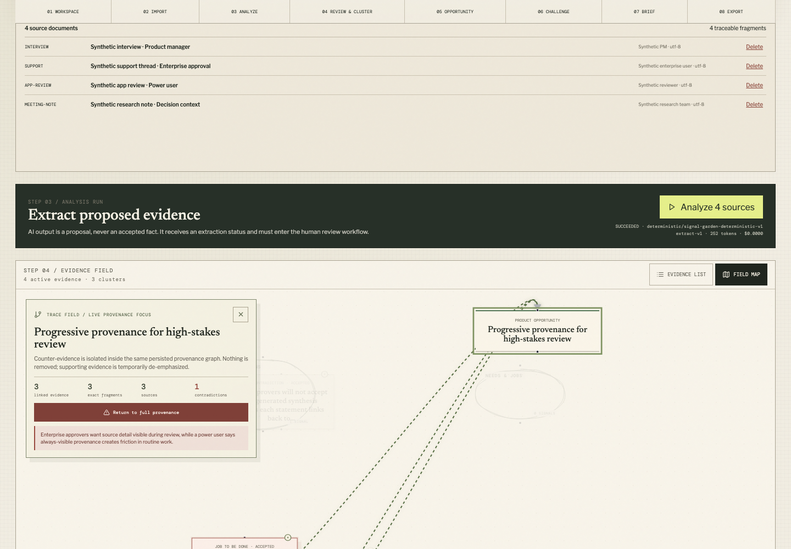
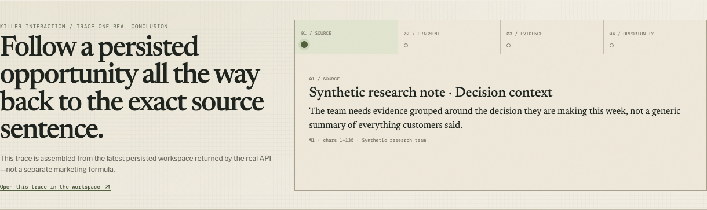
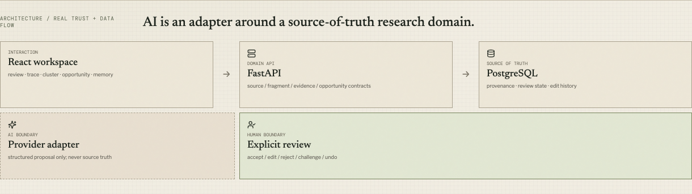

# Research Evidence Map

> **Reduce the AI verification tax between generated insight and human decision.**
>
> **AI가 만든 인사이트와 사람의 의사결정 사이에서 발생하는 `verification tax`를 줄입니다.**

Research Evidence Map is a full-stack **AI research verification and product-decision workspace**. It is built for teams that can already generate summaries quickly, but still need to verify what the AI concluded, inspect conflicting evidence, and preserve the evidence state that existed when a product decision was made.

Research Evidence Map은 **AI 리서치 검증과 제품 의사결정을 연결하는 full-stack workspace**입니다. AI로 요약을 빠르게 만드는 것보다, AI가 만든 결론을 원문과 대조하고 상충 근거를 확인하며 실제 제품 결정을 내린 순간의 검증 상태를 보존하는 데 초점을 둡니다.

Live product: **https://signals.oosu.dev/**

실제 서비스: **https://signals.oosu.dev/**

The interface supports **English / 한국어** switching. The selected language is remembered in the browser and shared across the home, workspace, research-memory, evidence-review, decision, brief, export, and read-only share flows.

화면 우측 상단에서 **English / 한국어**를 전환할 수 있습니다. 선택한 언어는 브라우저에 저장되며 홈, 워크스페이스, Research Memory, 근거 검토, 의사결정, 브리프, 내보내기, 읽기 전용 공유 화면에 함께 적용됩니다.

---

## Verification tax / 검증 비용

AI makes generation cheap. It does not automatically make verification cheap.

AI는 생성 비용을 빠르게 낮추지만 검증 비용까지 자동으로 낮추지는 않습니다.

In software development, Google DORA has described a similar effect as a **verification tax**: AI can increase the amount of code and review material produced, while correctness still has to be evaluated by humans and downstream systems. Faster generation can therefore move the bottleneck into review, testing, approval, and judgment.

소프트웨어 개발에서도 Google DORA는 비슷한 현상을 **verification tax**로 설명합니다. AI가 코드와 리뷰 자료의 생성량을 늘려도 정확성은 여전히 사람과 downstream system이 검증해야 합니다. 생성 속도가 빨라질수록 병목이 review, testing, approval, judgment로 이동할 수 있습니다.

Our broader thesis is:

우리의 상위 가설은 다음과 같습니다.

```text
AI output throughput
        grows faster than
human verification throughput
                ↓
The bottleneck moves from generation to verification.
```

```text
AI가 만드는 결과물의 처리량
        >
사람이 검증할 수 있는 처리량
        ↓
병목은 생성에서 검증으로 이동한다.
```

This repository tests that thesis first in **customer research → product decision** workflows.

이 repository는 이 가설을 먼저 **고객 리서치 → 제품 의사결정** workflow에서 검증합니다.

### External market signals / 외부 시장 신호

Current practitioner research supports the existence of the verification problem without proving product-market fit:

현재 practitioner research는 이 검증 문제가 존재한다는 방향성을 보여주지만, 이 제품의 product-market fit을 증명하는 것은 아닙니다.

- Condens 2026, n=332: **71%** said AI makes analysis significantly faster; **71%** also said validating AI output still takes significant time; **61%** review every AI output thoroughly.
- Condens 2026, 332명 조사: **71%**는 AI가 분석을 상당히 빠르게 만든다고 답했지만, 동시에 **71%**가 AI 결과 검증에 여전히 상당한 시간이 든다고 답했고 **61%**는 모든 AI 결과를 철저히 검토한다고 답했습니다.
- User Interviews 2025, n=485: **80%** reported AI use in research while **91%** expressed concern about AI-output accuracy or hallucination.
- User Interviews 2025, 485명 조사: **80%**가 research에 AI를 사용한다고 답했지만 **91%**는 AI 결과의 정확성 또는 hallucination을 우려했습니다.

Sources / 원본:

- https://condens.io/blog/ai-in-user-research-analysis-report/
- https://www.userinterviews.com/state-of-user-research-report
- https://dora.dev/insights/balancing-ai-tensions/

These are global sources. They are not presented as statistics about Korean product teams. Local pain frequency and willingness to pay still require direct validation.

위 자료는 글로벌 조사입니다. 한국 제품팀의 수치인 것처럼 사용하지 않습니다. 한국 시장에서 실제 pain의 빈도와 지불의사는 별도 고객검증이 필요합니다.

---

## Why product research first? / 왜 제품 리서치부터 시작하는가?

The verification-tax thesis can apply to many kinds of knowledge work. This product deliberately starts with a narrow vertical: product teams that analyze interviews, VOC, support threads, reviews, and research notes before making feature or roadmap decisions.

verification tax는 여러 지식노동 영역에 나타날 수 있습니다. 하지만 이 제품은 범위를 의도적으로 좁혀, 인터뷰·VOC·CS·리뷰·리서치 노트를 분석한 뒤 feature나 roadmap 결정을 내리는 product team부터 시작합니다.

The first customer hypothesis is a lean B2B SaaS product team without a large dedicated ResearchOps organization, where PMs, product designers, planners, founders, or CX/CS operators directly synthesize qualitative customer evidence.

첫 고객 가설은 대규모 전담 ResearchOps 조직이 없고 PM·Product Designer·서비스기획자·Founder·CX/CS 담당자가 직접 정성 고객근거를 분석하는 초기~성장기 B2B SaaS product team입니다.

This is a **hypothesis**, not a claimed market fact. The product is designed so that the vertical can change if direct customer validation shows that another verification workflow is more painful.

이 ICP는 **가설**이지 이미 검증된 시장 사실이 아닙니다. 실제 고객검증에서 다른 verification workflow의 pain이 더 강하면 vertical을 바꿀 수 있도록 제품 thesis와 첫 시장을 분리해 두었습니다.

---

## Product thesis / 제품 가설

The product does not try to win by generating more AI output. It structures the work required before a team is willing to trust and act on that output.

이 제품은 더 많은 AI output을 생성하는 것으로 경쟁하지 않습니다. 팀이 AI 결과를 신뢰하고 행동하기 전 반드시 수행해야 하는 검증 작업을 구조화합니다.

```text
SOURCE DOCUMENT
      ↓
ADDRESSABLE SOURCE FRAGMENT
      ↓
AI-PROPOSED EVIDENCE
      ↓
HUMAN REVIEW
      ↓
CONTRADICTION / CHALLENGE
      ↓
OPPORTUNITY
      ↓
HUMAN DECISION RECORD
      ↓
VERSIONED DECISION HISTORY
```

The AI can propose evidence and challenge an opportunity. It does **not** own the final decision.

AI는 evidence를 제안하거나 opportunity를 반증하는 일을 도울 수 있지만, **최종 의사결정의 owner가 아닙니다.**

---

## What makes this different? / 무엇을 다르게 검증하는가?

Source citation alone is not differentiation. Dovetail, Condens, Looppanel, Marvin, Productboard, and general-purpose LLM workflows already cover substantial parts of AI analysis, citation, review, opportunity management, or version history.

Source citation 자체는 차별화가 아닙니다. Dovetail, Condens, Looppanel, Marvin, Productboard와 범용 LLM workflow는 이미 AI 분석, citation, review, opportunity 관리, version history의 상당 부분을 제공합니다.

The narrower differentiation hypothesis being tested here is:

현재 검증 중인 더 좁은 차별화 가설은 다음과 같습니다.

- AI-proposed and human-reviewed evidence remain explicitly different states.
- AI가 제안한 근거와 사람이 검토한 근거를 명시적으로 다른 상태로 유지합니다.
- Supporting and contradictory evidence can coexist instead of being flattened into one summary.
- 지지 근거와 상충 근거를 하나의 요약으로 평준화하지 않고 함께 보존합니다.
- Opportunities can be challenged before commitment.
- 기회에 대해 commitment 전에 반증을 시도할 수 있습니다.
- A human decision snapshots reviewed/unresolved evidence, source fragments, contradictions, and challenge runs at the moment of judgment.
- 사람의 의사결정은 판단 당시의 reviewed/unresolved evidence, source fragment, contradiction, challenge 상태를 함께 snapshot합니다.
- Later decisions supersede earlier versions rather than rewriting history.
- 판단이 바뀌면 기존 결정을 덮어쓰지 않고 새 버전이 이전 버전을 supersede합니다.

The key question is not whether these features are technically possible. The open question is whether this workflow reduces enough verification tax that a real team will repeatedly use and pay for it.

핵심 질문은 이런 기능을 구현할 수 있는지가 아닙니다. 이 workflow가 실제 팀이 반복 사용하고 비용을 지불할 만큼 verification tax를 줄이는지가 아직 남아 있는 검증 과제입니다.

---

## Killer interaction / 핵심 상호작용

The product story is not “upload documents and get AI insights.”

제품의 핵심 이야기는 “문서를 올리고 AI insight를 받는다”가 아닙니다.

It is:

다음 흐름입니다.

1. Import customer evidence.  
   고객의 원문 근거를 가져옵니다.
2. Let AI propose structured evidence.  
   AI가 구조화된 evidence를 제안합니다.
3. Trace a proposal back to the exact source fragment.  
   제안을 정확한 원문 fragment까지 역추적합니다.
4. Accept, edit, reject, or leave evidence unresolved.  
   근거를 승인·수정·거절하거나 unresolved 상태로 둡니다.
5. Preserve contradictory evidence.  
   상충되는 근거를 삭제하지 않고 보존합니다.
6. Challenge the opportunity.  
   opportunity를 반증합니다.
7. Record `experiment`, `proceed`, `hold`, or `reject` with a human rationale.  
   사람의 판단 근거와 함께 `experiment`, `proceed`, `hold`, `reject`를 기록합니다.
8. Revisit the decision later without erasing v1.  
   나중에 판단이 달라져도 v1을 지우지 않고 새 버전을 남깁니다.

See [`docs/decision-demo.md`](docs/decision-demo.md) for the decision-centered demo script.

의사결정 중심 데모 스크립트는 [`docs/decision-demo.md`](docs/decision-demo.md)에 정리되어 있습니다.

---

## Existing product evidence / 현재 구현 증거

### Persisted opportunity → exact source

### 저장된 opportunity → 정확한 원문

The first-run experience is intentionally **sample-first rather than empty**. A fresh deployment bootstraps three persisted synthetic studies—**Trust & approval**, **First-run comprehension**, and **Research handoff**—through the real product APIs so visitors can inspect a meaningful verification workflow before creating anything.

첫 방문 화면은 빈 화면보다 **sample-first** 경험을 우선합니다. 새 배포에서는 **Trust & approval**, **First-run comprehension**, **Research handoff**라는 세 개의 가상 리서치를 실제 제품 API를 통해 저장해, 사용자가 직접 자료를 만들기 전에도 검증 workflow를 살펴볼 수 있습니다.

### Sample research library / 예시 리서치 라이브러리



The cross-workspace memory view immediately exposes repeated themes, new signals, unresolved gaps, and evidence-state-based opportunity priority:

워크스페이스 전체 Memory 화면에서는 반복 테마, 새 신호, 미해결 gap과 evidence-state 기반 opportunity 우선순위를 바로 확인할 수 있습니다.



### Killer interaction cluster — provenance and disagreement / 핵심 상호작용 — 출처와 반대 근거

Selecting an opportunity in the evidence map activates **Trace Field**: unrelated nodes are muted while the persisted opportunity, supporting evidence, exact fragments, source count, and contradiction count remain illuminated.

Evidence map에서 opportunity를 선택하면 **Trace Field**가 활성화됩니다. 관련 없는 노드는 흐려지고, 저장된 opportunity와 이를 지지하는 evidence, 정확한 fragment, source 수, contradiction 수가 강조됩니다.



When that conclusion has counter-evidence, **Contradiction Lens** isolates only the evidence that challenges it without deleting or rewriting the supporting chain.

반대 근거가 있다면 **Contradiction Lens**가 지지 근거를 삭제하거나 다시 쓰지 않은 채 해당 결론을 반박하는 evidence만 분리해 보여줍니다.



The exact source inspector remains available from every evidence item.

모든 evidence 항목에서는 정확한 원문 inspector로 다시 이동할 수 있습니다.



### Architecture proof / 아키텍처 증빙



---

## What is implemented / 현재 구현된 기능

- React + TypeScript research workspace with list and spatial evidence views.  
  React + TypeScript 기반 리서치 워크스페이스와 list/spatial evidence view.
- FastAPI API with persisted workspaces, sources, fragments, evidence, clusters, opportunities, challenges, decisions, and edit history.  
  workspace, source, fragment, evidence, cluster, opportunity, challenge, decision, edit history를 저장하는 FastAPI API.
- PostgreSQL-ready persistence with Alembic migrations and local database mode.  
  Alembic migration과 local database mode를 포함한 PostgreSQL-ready persistence.
- TXT / Markdown / CSV / JSON source intake with preview before analysis.  
  분석 전에 preview를 거치는 TXT / Markdown / CSV / JSON 원문 가져오기.
- Explicit human review state for AI-proposed evidence.  
  AI-proposed evidence에 대한 명시적 human review state.
- Merge/split cluster editing with undo/redo history.  
  undo/redo history가 있는 cluster merge/split.
- Exact source-fragment provenance in evidence inspection.  
  evidence inspector에서 exact source-fragment provenance 확인.
- Contradictions and opportunity challenges as first-class records.  
  contradiction과 opportunity challenge를 1급 record로 저장.
- Cross-workspace Research Memory and evidence-gap backlog.  
  여러 workspace를 가로지르는 Research Memory와 evidence-gap backlog.
- Versioned Decision Records with `proceed`, `experiment`, `hold`, and `reject`.  
  `proceed`, `experiment`, `hold`, `reject`를 지원하는 versioned Decision Record.
- Decision-time snapshots of reviewed/unresolved evidence, source fragments, contradictions, and challenge runs.  
  decision 시점의 reviewed/unresolved evidence, source fragment, contradiction, challenge run snapshot.
- Read-only sharing and Markdown / CSV / SVG / PNG export.  
  읽기 전용 공유와 Markdown / CSV / SVG / PNG export.
- English / Korean interface switching with browser persistence.  
  브라우저에 설정을 기억하는 영어 / 한국어 전환.
- Deterministic local adapter plus an optional OpenAI-compatible provider adapter.  
  deterministic local adapter와 선택 가능한 OpenAI-compatible provider adapter.

---

## AI boundary / AI의 역할 경계

AI output is treated as a proposal, not accepted research truth.

AI output은 확정된 리서치 사실이 아니라 **proposal**로 취급합니다.

The default local adapter is deterministic so that the full workflow can run without credentials. When an OpenAI-compatible provider is configured, structured output is schema-validated and still enters the same human-review flow.

기본 local adapter는 deterministic하게 동작하므로 외부 credential 없이 전체 workflow를 실행할 수 있습니다. OpenAI-compatible provider를 설정해도 structured output은 schema validation을 거친 뒤 동일한 human-review flow로 들어갑니다.

Provider, model, prompt version, schema version, token counts, and failure state are stored so generated synthesis can be distinguished from source material and human edits.

provider, model, prompt version, schema version, token count, failure state를 저장해 생성된 종합 결과와 원문, 사람의 수정을 구분합니다.

---

## Data honesty / 데이터 정직성

The guided demo uses synthetic data. Synthetic examples are explicitly illustrative and are never presented as customer validation, observed usage, revenue, or product-market-fit evidence.

가이드 데모는 synthetic data를 사용합니다. 가상 예시는 설명용일 뿐이며 실제 고객검증, 사용량, 매출, product-market fit 증거처럼 제시하지 않습니다.

The product can accept real research material, but production use with sensitive customer research would require stronger authentication, organization authorization, monitoring, backup, and incident procedures.

실제 리서치 자료도 입력할 수 있지만 민감한 고객 리서치를 production 환경에서 사용하려면 authentication, organization authorization, monitoring, backup, incident procedure를 더 강화해야 합니다.

---

## Architecture & Topics / 아키텍처 및 주제

```text
src/
  api/            browser API client
  canvas/         evidence-map visualization
  components/     shared UI + language toggle
  features/       import, review, cluster, opportunity, decision, brief, export
  i18n/           English / Korean locale state
  routes/         home, workspace, read-only share
  schemas/        runtime domain validation
  state/          workspace UI state + history

api/
  app/            FastAPI service, persistence, provider adapters
  alembic/        database migrations
```

The domain chain is explicit:

domain 흐름을 명시적으로 유지합니다.

```text
SOURCE DOCUMENT
→ SOURCE FRAGMENT
→ EVIDENCE
→ CLUSTER
→ OPPORTUNITY
→ HUMAN DECISION
```

**Architecture topics / 아키텍처 주제**  
[`research-ops`](https://github.com/topics/research-ops) · [`knowledge-graph`](https://github.com/topics/knowledge-graph) · [`provenance`](https://github.com/topics/provenance) · [`human-in-the-loop`](https://github.com/topics/human-in-the-loop) · [`decision-intelligence`](https://github.com/topics/decision-intelligence)

**Implementation stack / 구현 스택**  
[`react`](https://github.com/topics/react) · [`typescript`](https://github.com/topics/typescript) · [`fastapi`](https://github.com/topics/fastapi) · [`postgresql`](https://github.com/topics/postgresql) · [`react-flow`](https://github.com/topics/react-flow)

---

## Design decisions / 설계 원칙

**Why explicit review state?** Extracted evidence can be wrong. Proposed evidence therefore moves through human review rather than being silently promoted to fact.

**왜 review state를 명시하는가?** 추출된 evidence는 틀릴 수 있습니다. 따라서 AI 제안을 조용히 사실로 승격하지 않고 사람의 검토 단계를 통과시킵니다.

**Why contradictions?** A synthesis should not become more persuasive by hiding the evidence that weakens it.

**왜 contradiction을 보존하는가?** 결론을 약화하는 근거를 숨김으로써 synthesis가 더 그럴듯해져서는 안 됩니다.

**Why a separate Decision Record?** An opportunity is a hypothesis. A decision is a human commitment made at a specific point in time.

**왜 Decision Record를 별도로 두는가?** opportunity는 가설이고 decision은 특정 시점에 사람이 책임지고 내린 commitment입니다.

**Why version decisions instead of overwrite?** A changed decision is evidence about learning. Rewriting v1 destroys the path that explains how the team changed its mind.

**왜 결정을 overwrite하지 않고 versioning하는가?** 바뀐 판단 자체가 학습의 증거입니다. v1을 덮어쓰면 팀이 왜 생각을 바꿨는지 설명하는 경로가 사라집니다.

**Why preserve deterministic mode?** The workflow should remain inspectable without requiring an external model or hiding domain behavior behind generated text.

**왜 deterministic mode를 유지하는가?** 외부 모델 없이도 workflow 전체를 관찰할 수 있어야 하며 domain behavior가 생성형 텍스트 뒤에 숨지 않아야 합니다.

---

## Local development / 로컬 개발

```bash
corepack pnpm install
docker compose up -d
corepack pnpm dev
```

Default web address / 기본 주소:

```text
http://localhost:3101
```

Useful checks / 주요 검증 명령:

```bash
corepack pnpm typecheck
corepack pnpm lint
corepack pnpm test
corepack pnpm build
```

---

## Project status / 프로젝트 상태

This is a working full-stack product experiment, not a mature multi-tenant SaaS. The current work focuses on verifying whether a narrow **verification-first product-decision workflow** creates enough real value for lean product teams.

현재 프로젝트는 작동하는 full-stack product experiment이며 성숙한 multi-tenant SaaS라고 주장하지 않습니다. 지금의 핵심 목표는 **verification-first product-decision workflow**가 실제 lean product team에게 충분한 가치를 만드는지 검증하는 것입니다.

The most important unresolved questions are customer-side, not technical:

현재 가장 중요한 미해결 질문은 기술보다 고객 쪽에 있습니다.

- How often do Korean B2B SaaS product teams re-check AI analysis against raw sources?  
  한국 B2B SaaS 제품팀은 AI 분석을 원문과 얼마나 자주 다시 대조하는가?
- How much time does that verification take?  
  그 검증에 실제로 얼마나 많은 시간이 드는가?
- Is contradiction handling useful or documentation overhead?  
  contradiction 관리가 가치인가, 문서화 부담인가?
- Is a decision-time verification snapshot a repeated workflow or a niche feature?  
  decision-time verification snapshot이 반복 workflow인가, 일부 상황의 niche feature인가?
- Who owns the budget, and what existing tool spend can this replace or complement?  
  누가 구매 예산을 가지고 있으며 어떤 기존 tool spend를 대체하거나 보완할 수 있는가?

---

## Credits / 크레딧

Third-party libraries and visual references are documented in [`CREDITS.md`](CREDITS.md) and the supporting `docs/` notes.

사용한 third-party library와 visual reference는 [`CREDITS.md`](CREDITS.md) 및 `docs/` 문서에 기록되어 있습니다.
