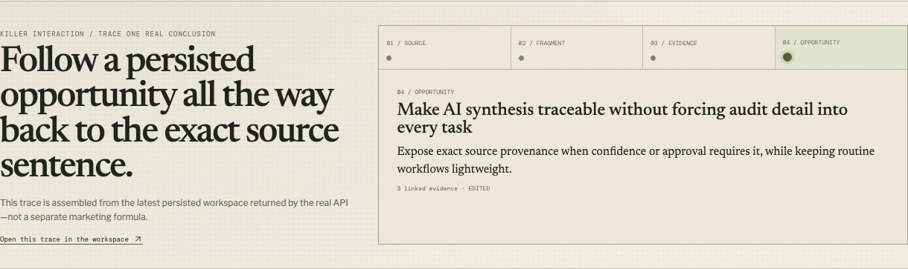

# Research Evidence Map

The product now includes a deterministic **Research Operations / Research Memory** layer across saved workspaces. It provides cross-workspace evidence/source/theme/opportunity search, recurring-vs-new signal comparison for the latest research, a derived unresolved research/evidence-gap backlog, repeated-theme detection, and opportunity prioritization based on human review, source coverage, and explicit contradictions rather than fabricated AI confidence scores.

Research Evidence Map is a full-stack **AI research verification and product-decision workspace**. It is designed for product teams that can already generate summaries quickly, but still need to verify what the AI concluded, inspect conflicting evidence, and preserve the evidence that existed when a product decision was made.

## Product thesis

The bottleneck is moving.

AI can already summarize interviews, support threads, reviews, and research notes. The harder operational problem is the **verification step between AI analysis and a decision a team is willing to defend**.

Two current practitioner surveys support that direction without proving product-market fit:

- Maze's 2026 research report says 69% of respondents use AI in at least some research and 66% report increased research demand.
- Condens' 2026 survey of 332 practitioners reports that 71% say AI makes analysis significantly faster, while 71% also say validating AI output still takes significant time; 61% review every AI output thoroughly.

Sources:

- https://maze.co/resources/user-research-report/
- https://condens.io/blog/ai-in-user-research-analysis-report/

These are global, vendor-published surveys. They are treated as market signals, not claims about Korean product teams. Local pain frequency and willingness to pay still require direct customer validation.

## Portfolio case study

This project is **Inspectable AI Systems / 01 — Research**. The portfolio thesis is that AI-assisted software should expose the provenance, uncertainty, computation, and human judgment needed to challenge its output rather than hiding those boundaries behind fluent generation.

The first-run experience is intentionally structured as a compact case study: **Before → Problem → Insight → Architecture → Interaction → Result**. Its representative interaction is a provenance trace assembled from the latest persisted workspace: `OPPORTUNITY → REVIEWED EVIDENCE → SOURCE FRAGMENT → SOURCE`. The home trace and the workspace inspector read the same API/domain records rather than using a separate marketing-only data path.

### Killer interaction — one persisted conclusion, traced backward



The same interactive trace can be rewound to the exact imported source and locator:


### Architecture proof


**Common approach:** documents → generated summary → recommendation.  
**This system:** source → addressable fragment → AI proposal → human review → contradiction/challenge → opportunity → human decision snapshot.

The project began as a visual experiment called **Signal Garden**. The current implementation keeps that cartographic visual language only where it helps people scan clusters; the product itself is organized around a concrete research workflow rather than the metaphor.

## Problem

Customer interviews, app reviews, support threads, and meeting notes can now be synthesized quickly with general-purpose or research-specific AI. But a product team still has to answer a different set of questions before acting:

- Which exact source fragments support this conclusion?
- Which evidence has actually been reviewed by a human?
- What contradicts the conclusion?
- Did the team challenge the opportunity before committing to it?
- What evidence existed at the moment the decision was made?
- If the decision changed later, why did it change?

This project tests a narrower idea: **AI-assisted research should not stop at a cited answer. Verification state and the resulting human decision should be first-class, traceable records.**

## Working flow

```text
Create research workspace
→ import real source material
→ preview source scope
→ extract proposed evidence
→ human review
→ merge / split clusters
→ derive opportunities
→ challenge an opportunity
→ record a human decision
→ revise the decision without overwriting history
→ inspect the decision-time evidence snapshot
→ export or share read-only
```

## What is implemented

- React + TypeScript research workspace with list and spatial evidence views.
- FastAPI API with persisted workspaces, sources, fragments, evidence, clusters, opportunities, challenges, **human decisions**, and edit history.
- PostgreSQL-ready persistence with Alembic migrations and a local database mode.
- Text/file source intake with explicit preview before analysis.
- Human review states for AI-proposed evidence.
- Research-state summary showing source coverage, human-review progress, opportunity support, contradictions, and the next evidence gap to address.
- Merge/split cluster editing with undo/redo history.
- Source-fragment provenance in the evidence inspector and read-only share view.
- Optional OpenAI-compatible extraction/challenge adapter.
- Deterministic local adapter when no external model is configured.
- Exportable evidence map and source register.
- Searchable/filterable evidence review queue with bulk human-review actions.
- Deterministic Research Brief export with cluster/source coverage, opportunity hypotheses, and contradiction summary.
- Versioned Decision Records with outcomes (`proceed`, `experiment`, `hold`, `reject`), rationale, next step, and immutable decision-time snapshots of reviewed/unresolved evidence, source fragments, contradictions, and challenge runs.
- Decision revision through a superseding version chain instead of silently overwriting the prior judgment.
- Reduced-motion, lower-power, keyboard, mobile, and accessibility handling.
- First-run guided demo that creates synthetic source documents through the real API, runs analysis, records reviewed evidence, creates an opportunity and contradiction, and walks through the resulting workspace.

## AI boundary

AI output is treated as a proposal, not accepted research truth.

The default local adapter is deterministic and intentionally simple. It exists so the complete workflow can run without credentials. When an OpenAI-compatible provider is configured, structured output is schema-validated and still enters the same human-review flow.

The UI records provider, model, prompt version, schema version, token counts, and failure state so generated synthesis is distinguishable from imported source material and human edits.

## Data honesty

The application accepts real research material. Any empty-state or development fixture is illustrative only and is not presented as observed customer evidence.

The core chain is explicit throughout the codebase:

```text
SOURCE DOCUMENT → SOURCE FRAGMENT → EVIDENCE → CLUSTER → OPPORTUNITY → HUMAN DECISION
```

## Architecture

```text
src/
  api/            browser API client
  canvas/         evidence map visualization
  features/       import, evidence, opportunity, decision, export workflows
  routes/         home, workspace, read-only share
  schemas/        runtime domain validation
  state/          workspace state and history

api/
  app/            FastAPI service, persistence, provider adapters
  alembic/        database migrations
```

## Design decisions

**Why keep a map at all?** Spatial grouping is useful for scanning agreement, contradiction, and density, but the list view remains a first-class alternative. The map is not the source of truth.

**Why preserve deterministic mode?** A research workflow should remain inspectable without requiring an external model or hiding behavior behind generated text. Provider-backed analysis is an adapter, not the domain model.

**Why explicit review state?** Extracted evidence can be wrong. Proposed evidence therefore moves through human review rather than being silently promoted to fact.

**Why a separate Decision Record?** An opportunity is still a hypothesis. A decision is a human commitment made at a specific point in time. The application stores the evidence and unresolved context that existed at that moment so later revisions can be explained rather than retroactively rewritten.

## Demo narrative

The shortest product story is not “upload documents and get AI insights.” It is:

1. Import three pieces of customer evidence.
2. Let the deterministic or provider adapter propose evidence.
3. Accept one item, edit another, and leave one unresolved.
4. Create an opportunity and surface a contradiction.
5. Challenge the opportunity and trace the response to source fragments.
6. Record `experiment`, `hold`, `proceed`, or `reject` with a human rationale.
7. Revise the decision and show that v1 remains intact while v2 supersedes it.

See [`docs/decision-demo.md`](docs/decision-demo.md) for the application-oriented demo script and what each step proves.

## Local development

```bash
corepack pnpm install
docker compose up -d
corepack pnpm dev
```

Default web address: `http://localhost:3101`

The deployed instance is linked from the repository homepage.

## Project status

This is a working full-stack reference implementation and ongoing product experiment. It is not presented as a mature multi-tenant SaaS service. Authentication, organization-level authorization, operational monitoring, backup policy, and production incident procedures would need to be added before exposing sensitive research data to untrusted networks.

## Credits

Third-party libraries and visual references are documented in [`CREDITS.md`](CREDITS.md) and the supporting `docs/` notes.
