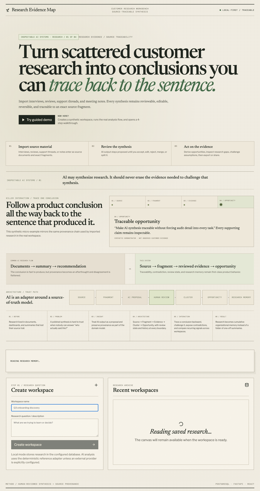

# Research Evidence Map

The product now includes a deterministic **Research Operations / Research Memory** layer across saved workspaces. It provides cross-workspace evidence/source/theme/opportunity search, recurring-vs-new signal comparison for the latest research, a derived unresolved research/evidence-gap backlog, repeated-theme detection, and opportunity prioritization based on human review, source coverage, and explicit contradictions rather than fabricated AI confidence scores.

Research Evidence Map is a full-stack workspace for turning customer research into reviewable product evidence without losing the source trail.

## Portfolio case study

This project is **Inspectable AI Systems / 01 — Research**. The portfolio thesis is that AI-assisted software should expose the provenance, uncertainty, computation, and human judgment needed to challenge its output rather than hiding those boundaries behind fluent generation.

The first-run experience is intentionally structured as a compact case study: **Before → Problem → Insight → Architecture → Interaction → Result**. Its representative interaction is a provenance trace that walks one conclusion backward through `OPPORTUNITY → REVIEWED EVIDENCE → SOURCE FRAGMENT → SOURCE`, making the trust model visible before a reviewer enters the full workspace.



**Common approach:** documents → generated summary → recommendation.  
**This system:** source → addressable fragment → AI proposal → human review → cluster/opportunity → cross-workspace research memory.

The project began as a visual experiment called **Signal Garden**. The current implementation keeps that cartographic visual language only where it helps people scan clusters; the product itself is organized around a concrete research workflow rather than the metaphor.

## Problem

Customer interviews, app reviews, support threads, and meeting notes usually end up scattered across documents and dashboards. Synthesis is useful, but it becomes hard to trust once the connection between a conclusion and the original source is lost.

This project tests a narrower idea: every AI-assisted synthesis should remain inspectable, reversible, and traceable to the exact source fragment that produced it.

## Working flow

```text
Create research workspace
→ import real source material
→ preview source scope
→ extract proposed evidence
→ human review
→ merge / split clusters
→ derive opportunities
→ challenge an opportunity
→ inspect provenance
→ export or share read-only
```

## What is implemented

- React + TypeScript research workspace with list and spatial evidence views.
- FastAPI API with persisted workspaces, sources, fragments, evidence, clusters, opportunities, challenges, and edit history.
- PostgreSQL-ready persistence with Alembic migrations and a local database mode.
- Text/file source intake with explicit preview before analysis.
- Human review states for AI-proposed evidence.
- Research-state summary showing source coverage, human-review progress, opportunity support, contradictions, and the next evidence gap to address.
- Merge/split cluster editing with undo/redo history.
- Source-fragment provenance in the evidence inspector and read-only share view.
- Optional OpenAI-compatible extraction/challenge adapter.
- Deterministic local adapter when no external model is configured.
- Exportable evidence map and source register.
- Searchable/filterable evidence review queue with bulk human-review actions.
- Deterministic Research Brief export with cluster/source coverage, opportunity hypotheses, and contradiction summary.
- Reduced-motion, lower-power, keyboard, mobile, and accessibility handling.
- First-run guided demo that creates synthetic source documents through the real API, runs analysis, records reviewed evidence, creates an opportunity and contradiction, and walks through the resulting workspace.

## AI boundary

AI output is treated as a proposal, not accepted research truth.

The default local adapter is deterministic and intentionally simple. It exists so the complete workflow can run without credentials. When an OpenAI-compatible provider is configured, structured output is schema-validated and still enters the same human-review flow.

The UI records provider, model, prompt version, schema version, token counts, and failure state so generated synthesis is distinguishable from imported source material and human edits.

## Data honesty

The application accepts real research material. Any empty-state or development fixture is illustrative only and is not presented as observed customer evidence.

The core chain is explicit throughout the codebase:

```text
SOURCE DOCUMENT → SOURCE FRAGMENT → EVIDENCE → CLUSTER → OPPORTUNITY
```

## Architecture

```text
src/
  api/            browser API client
  canvas/         evidence map visualization
  features/       import, evidence, opportunity, export workflows
  routes/         home, workspace, read-only share
  schemas/        runtime domain validation
  state/          workspace state and history

api/
  app/            FastAPI service, persistence, provider adapters
  alembic/        database migrations
```

## Design decisions

**Why keep a map at all?** Spatial grouping is useful for scanning agreement, contradiction, and density, but the list view remains a first-class alternative. The map is not the source of truth.

**Why preserve deterministic mode?** A research workflow should remain inspectable without requiring an external model or hiding behavior behind generated text. Provider-backed analysis is an adapter, not the domain model.

**Why explicit review state?** Extracted evidence can be wrong. Proposed evidence therefore moves through human review rather than being silently promoted to fact.

## Local development

```bash
corepack pnpm install
docker compose up -d
corepack pnpm dev
```

Default web address: `http://localhost:3101`

The deployed instance is linked from the repository homepage.

## Project status

This is a working full-stack reference implementation and ongoing product experiment. It is not presented as a mature multi-tenant SaaS service. Authentication, organization-level authorization, operational monitoring, backup policy, and production incident procedures would need to be added before exposing sensitive research data to untrusted networks.

## Credits

Third-party libraries and visual references are documented in [`CREDITS.md`](CREDITS.md) and the supporting `docs/` notes.
